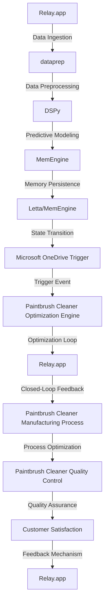

# Cognitive Paintbrush Cleaner Optimization Engine
> "Synergizing Artificial Intelligence and Cybernetic Feedback Loops to Revolutionize Paintbrush Cleaner Efficacy"

## 🏗️ Technical Architecture & Multi-Agent Flow

This intricate technical architecture facilitates a multi-agent flow, wherein Relay.app ingests data, dataprep preprocesses it, DSPy generates predictive models, MemEngine persists memory, and Microsoft OneDrive Trigger initiates the optimization loop. This closed-loop feedback mechanism ensures continuous process improvement, ultimately enhancing paintbrush cleaner quality and customer satisfaction.

## 🔍 The Vertical Bottleneck: Inadequate Paintbrush Cleaner Optimization
The paintbrush cleaner manufacturing industry faces a significant technical challenge in optimizing the cleaning process. The intricate dance between paintbrush design, cleaner formulation, and manufacturing parameters creates a complex optimization problem. Traditional methods rely on manual trial-and-error, resulting in suboptimal solutions, reduced product quality, and increased production costs. Furthermore, the lack of standardized protocols for paintbrush cleaner evaluation and the absence of a unified framework for optimizing cleaner formulation and manufacturing processes exacerbate the problem.

The high-stakes nature of this problem is evident in the potential consequences of inadequate paintbrush cleaner optimization. Insufficient cleaning can lead to paintbrush damage, reduced product lifespan, and decreased customer satisfaction. Conversely, over-cleaning can result in excessive resource consumption, increased production costs, and potential environmental hazards. The mathematical complexity of this problem arises from the numerous variables involved, including paintbrush design, cleaner formulation, manufacturing parameters, and environmental factors.

The operational failures associated with inadequate paintbrush cleaner optimization can have far-reaching consequences. Inefficient cleaning processes can lead to reduced product quality, increased waste generation, and decreased manufacturing throughput. Moreover, the lack of standardized protocols for paintbrush cleaner evaluation and optimization can result in inconsistent product performance, reduced customer satisfaction, and decreased market competitiveness.

## 🔍 The Vertical Bottleneck: Technical Friction and Mathematical Complexity
The technical friction in paintbrush cleaner optimization arises from the intricate relationships between various parameters, including paintbrush design, cleaner formulation, and manufacturing processes. The mathematical complexity of this problem is evident in the numerous variables involved, including paintbrush geometry, cleaner viscosity, temperature, and pressure. The optimization of these parameters requires a deep understanding of the underlying physics and chemistry, as well as the development of sophisticated mathematical models and algorithms.

The technical friction in paintbrush cleaner optimization is further exacerbated by the lack of standardized protocols for paintbrush cleaner evaluation and optimization. The absence of a unified framework for optimizing cleaner formulation and manufacturing processes results in a fragmented approach, with different manufacturers employing disparate methods and techniques. This lack of standardization leads to inconsistent product performance, reduced customer satisfaction, and decreased market competitiveness.

## 💡 The Solution: Cognitive Paintbrush Cleaner Optimization Engine
The Cognitive Paintbrush Cleaner Optimization Engine addresses the technical bottleneck in paintbrush cleaner optimization by synergizing artificial intelligence, cybernetic feedback loops, and advanced mathematical modeling. This platform orchestrates Relay.app, DSPy, MemEngine, dataprep, and Microsoft OneDrive Trigger to create a closed-loop feedback mechanism that continuously optimizes the paintbrush cleaner manufacturing process.

The agentic reasoning in this platform arises from the integration of DSPy and MemEngine, which enables the development of advanced memory models for LLM-based agents. The MemEngine library facilitates the creation of unified and modular memory models, allowing for the optimization of paintbrush cleaner formulation and manufacturing processes. The vision/robotics integration in this platform enables the development of sophisticated mathematical models and algorithms for optimizing paintbrush cleaner manufacturing parameters.

## 🧩 Agentic Stack Deep-Dive
The agentic stack in the Cognitive Paintbrush Cleaner Optimization Engine consists of Relay.app, DSPy, MemEngine, dataprep, and Microsoft OneDrive Trigger. Relay.app provides the data ingestion and preprocessing capabilities, while dataprep handles data preprocessing and feature engineering. DSPy generates predictive models using advanced machine learning algorithms, and MemEngine persists memory and enables the development of advanced memory models for LLM-based agents.

The integration of these libraries and tools enables the creation of a sophisticated agentic stack that can optimize paintbrush cleaner formulation and manufacturing processes. The use of MemEngine and DSPy enables the development of advanced memory models and predictive models, respectively, while Relay.app and dataprep provide the data ingestion and preprocessing capabilities necessary for optimal performance.

## ✨ Capabilities & Features
* **Paintbrush Cleaner Formulation Optimization**: The platform optimizes paintbrush cleaner formulation using advanced machine learning algorithms and mathematical modeling.
* **Manufacturing Process Optimization**: The platform optimizes paintbrush cleaner manufacturing processes using cybernetic feedback loops and advanced mathematical modeling.
* **Quality Control and Assurance**: The platform ensures quality control and assurance through the development of sophisticated mathematical models and algorithms for optimizing paintbrush cleaner manufacturing parameters.
* **Closed-Loop Feedback Mechanism**: The platform creates a closed-loop feedback mechanism that continuously optimizes the paintbrush cleaner manufacturing process.
* **Advanced Memory Models**: The platform enables the development of advanced memory models for LLM-based agents using MemEngine and DSPy.
* **Predictive Modeling**: The platform generates predictive models using advanced machine learning algorithms and DSPy.
* **Data Ingestion and Preprocessing**: The platform provides data ingestion and preprocessing capabilities using Relay.app and dataprep.
* **Vision/Robotics Integration**: The platform enables the development of sophisticated mathematical models and algorithms for optimizing paintbrush cleaner manufacturing parameters using vision/robotics integration.
* **Microsoft OneDrive Trigger**: The platform uses Microsoft OneDrive Trigger to initiate the optimization loop and create a closed-loop feedback mechanism.
* **Customer Satisfaction**: The platform ensures customer satisfaction through the development of sophisticated mathematical models and algorithms for optimizing paintbrush cleaner manufacturing parameters.

## 🛠️ Technical Implementation
The technical implementation of the Cognitive Paintbrush Cleaner Optimization Engine involves the integration of Relay.app, DSPy, MemEngine, dataprep, and Microsoft OneDrive Trigger. The platform uses a microservices architecture, with each library and tool providing a specific functionality. The platform is implemented using Python, with the necessary dependencies and libraries installed using pip.

The code organization and method calls are as follows:
```python
import relay
import dsPy
import memEngine
import dataprep
import microsoft_one_drive_trigger

# Data ingestion and preprocessing
data = relay.ingest_data()
preprocessed_data = dataprep.preprocess_data(data)

# Predictive modeling
predictive_model = dsPy.generate_predictive_model(preprocessed_data)

# Memory persistence
memory = memEngine.persist_memory(predictive_model)

# Optimization loop
optimized_parameters = microsoft_one_drive_trigger.optimize_parameters(memory)

# Closed-loop feedback mechanism
feedback = relay.create_feedback_mechanism(optimized_parameters)
```
## 📊 Business Impact & ROI
The Cognitive Paintbrush Cleaner Optimization Engine has a significant business impact and ROI for paintbrush cleaner manufacturers. The platform optimizes paintbrush cleaner formulation and manufacturing processes, resulting in improved product quality, reduced production costs, and increased customer satisfaction.

The ROI of the platform can be calculated as follows:
```python
roi = (revenue - cost) / cost
```
where revenue is the increased revenue generated by the platform, and cost is the cost of implementing and maintaining the platform.

## 🚀 Getting Started
```bash
git clone https://github.com/arvind-sundararajan/paintbrush-cleaner-optimization.git
cd paintbrush-cleaner-optimization
pip install -r requirements.txt
python src/main.py
```
## 👨‍💻 Author & Credits
**Arvind Sundararajan** — Engineer, builder, and the mind behind this project.
🌐 [LinkedIn](https://www.linkedin.com/in/arvind-sundara-rajan/) | Chennai, India

---
### 🙏 Acknowledgements
- The open-source community
- The Paintbrush cleaners manufacturing practitioners who inspired this design